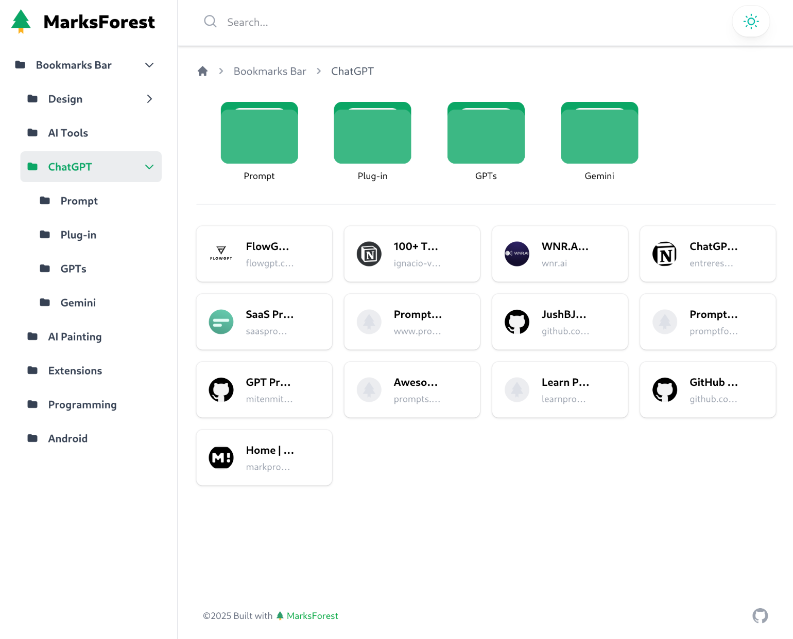

> This project is forked from [Pintree/pintree-old-dev](https://github.com/Pintree-io/pintree/tree/pintree-old-dev), with new features and improvements

Pintree is an open-source project that aims to convert browser bookmarks into a navigation website. With just a few simple steps, you can transform your bookmarks into a beautiful and user-friendly navigation page.



# New Features

- **Added support for both Google Bookmarks and Pintree bookmarks**
- Upgraded Tailwind and enhanced development experience
- Improved icon fetching with Service Worker caching for offline support
- Enhanced sidebar with manual size adjustment and folder layout fixes
- Implemented URL path support
- Added animated search bar positioning
- Introduced mobile sidebar support with dark mode and search functionality
- Optimized bookmark card layout with responsive design and animations
- Implemented new breadcrumb navigation

# Development

To set up the development environment:

1. Fork the project
2. Clone your fork: `git clone https://github.com/YOUR_USERNAME/MarksForest.git`
3. Navigate to the project directory: `cd MarksForest`
4. Install dependencies: `npm install`
5. Start the development server: `npm run dev`

# Usage

## Option 1: Using Google Chrome Bookmarks

1. Locate your Chrome bookmarks file:

   - Linux: `~/.config/google-chrome/Default/Bookmarks`
   - Windows: `C:\Users\%USERNAME%\AppData\Local\Google\Chrome\User Data\Default\Bookmarks`
   - macOS: `~/Library/Application Support/Google/Chrome/Default/Bookmarks`

2. Copy this file to `json/marksforest.json` in the project directory.

## Option 2: Using Pintree Bookmarks Exporter

1. Install the [Pintree Bookmarks Exporter](https://chromewebstore.google.com/detail/pintree-bookmarks-exporte/mjcglnkikjidokobpfdcdmcnfdicojce) Chrome extension.
2. Export your bookmarks and save the JSON file.
3. Replace `json/marksforest.json` in the project directory with this exported file.

## 🚀 一体化部署 (推荐)

MarksForest 现在支持一体化部署，无需分别部署前后端！

### Docker 一键部署

```bash
# 克隆项目
git clone https://github.com/YOUR_USERNAME/MarksForest.git
cd MarksForest

# 一键部署
./deploy.sh
```

访问地址：
- 🌐 前台网站: http://localhost:8080
- 🔧 管理后台: http://localhost:8080/admin

### 手动部署

如果您的环境不支持Docker，可以使用传统方式：

#### 开发环境
```bash
# 启动后端
cd admin
npm run install:all
npm run dev

# 启动前端 (新终端)
cd admin/client
npm run dev
```

#### 生产环境
```bash
# 构建前端
cd admin/client
npm run build

# 启动服务
cd admin
npm start
```

### 管理后台使用
1. 访问 http://localhost/admin
2. 使用默认密码登录 (查看 .env 文件)
3. 开始管理您的书签和文件夹
